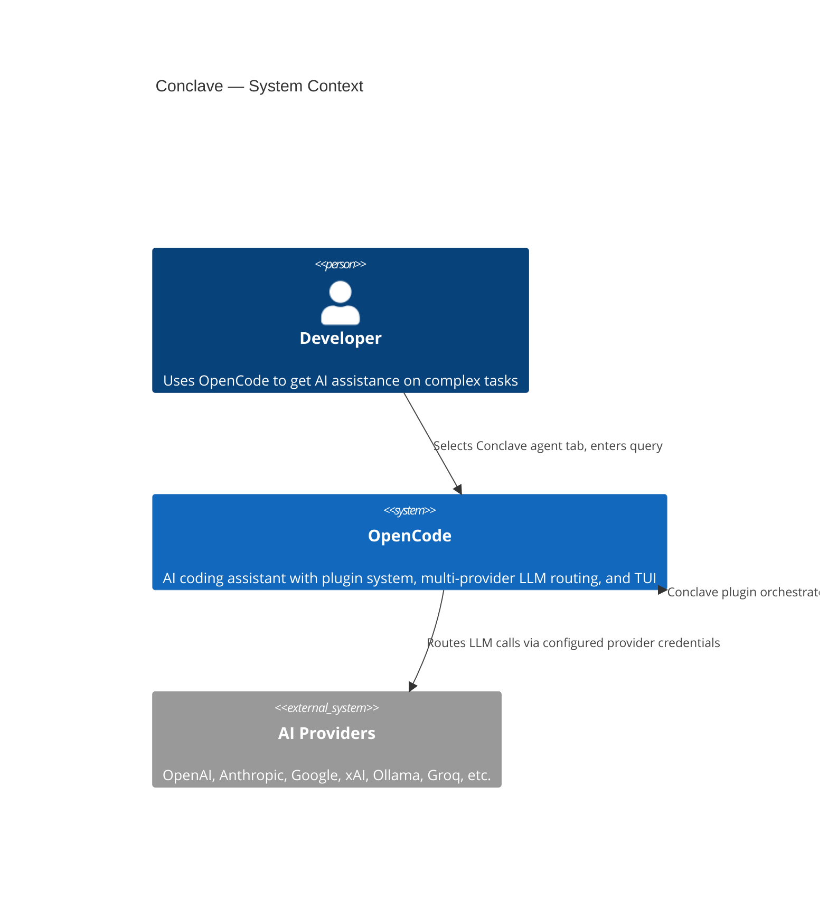
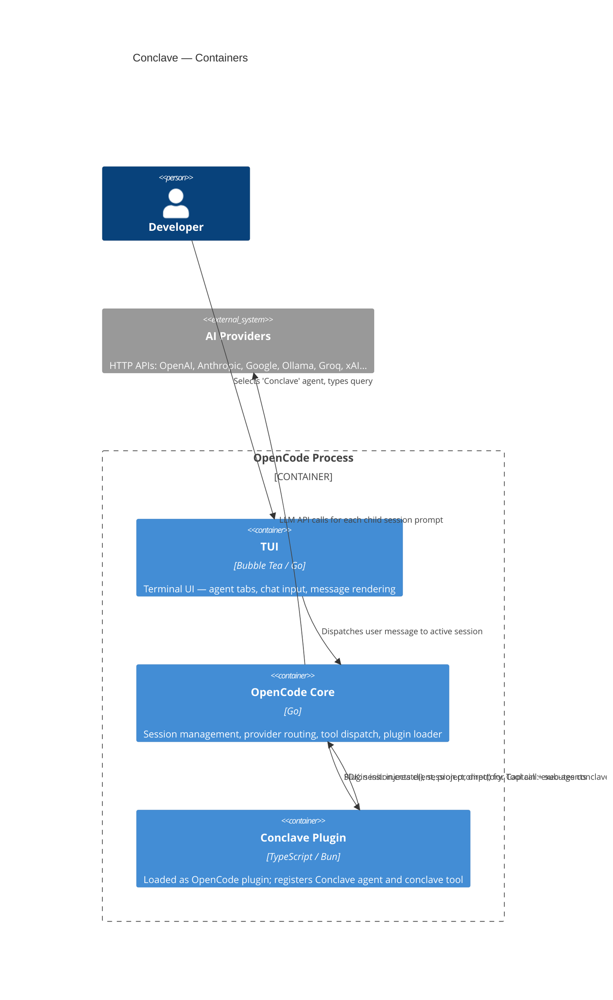
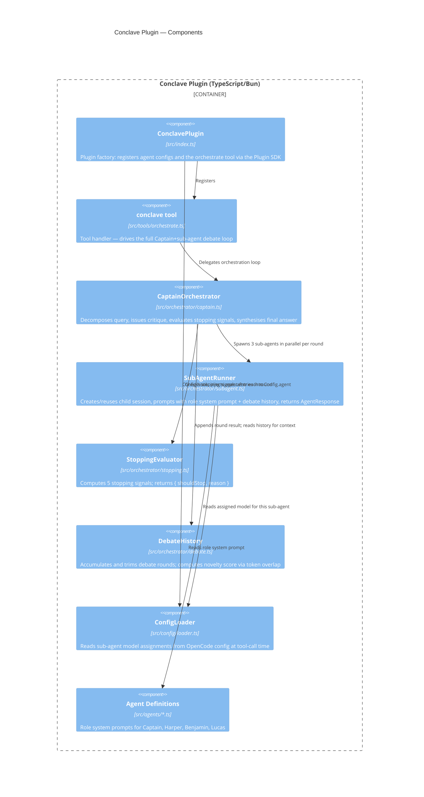
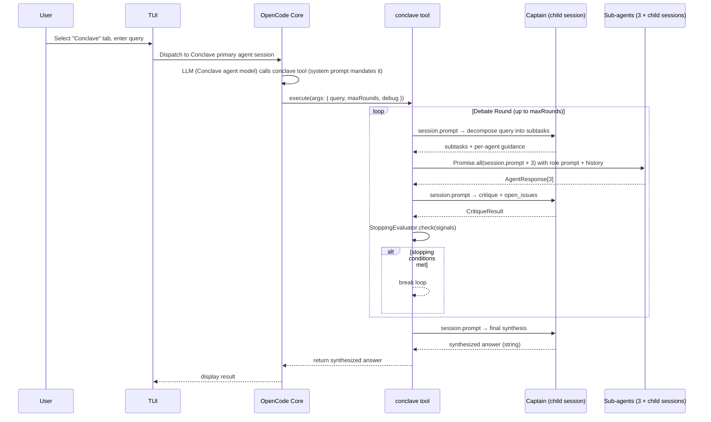
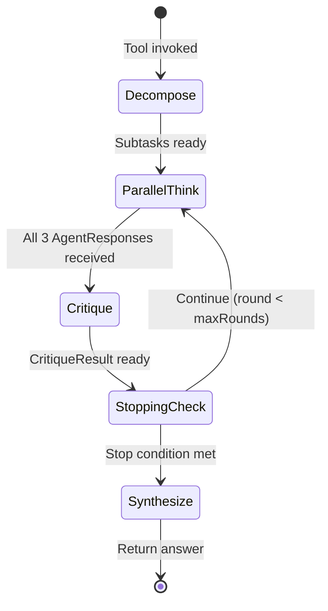

# Conclave — Architecture Design

**Feature**: Multi-agent orchestration plugin for OpenCode
**Date**: 2026-03-27
**Status**: Draft

---

## 1. Overview

Conclave is an OpenCode plugin that implements a Grok-4.20-style multi-agent debate system. A **Captain** agent decomposes queries, coordinates parallel **sub-agent** deliberations across multiple rounds, applies early-stopping heuristics, and synthesises a final answer.

The plugin:
- Registers as a **primary agent** (selectable tab in the OpenCode TUI)
- Exposes a single `conclave` tool that drives the orchestration loop
- Spawns **child sessions** per sub-agent via the OpenCode SDK, so every AI call goes through OpenCode's configured providers — no separate API keys needed
- Is fully model-agnostic: each sub-agent's provider/model is stored in `config.agent.<name>.model`

---

## 2. C4 System Context Diagram



---

## 3. C4 Container Diagram



---

## 4. C4 Component Diagram — Conclave Plugin



---

## 5. Interaction Flow



---

## 6. Integration with OpenCode Plugin SDK

### 6.1 Plugin Registration

```
ConclavePlugin: Plugin = async (input: PluginInput) => ({
  tool: { conclave: orchestrateTool },
  config: async (cfg) => {
    // Register Conclave as a primary agent
    cfg.agent ??= {};
    cfg.agent['conclave'] = {
      mode: 'primary',
      description: 'Multi-agent debate orchestrator',
      prompt: CONCLAVE_SYSTEM_PROMPT,
      color: '#7C3AED',
    };
    // Register sub-agents (subagent mode, not shown in tabs)
    cfg.agent['conclave-captain'] = { mode: 'subagent', prompt: CAPTAIN_PROMPT };
    cfg.agent['conclave-harper']  = { mode: 'subagent', prompt: HARPER_PROMPT };
    cfg.agent['conclave-benjamin']= { mode: 'subagent', prompt: BENJAMIN_PROMPT };
    cfg.agent['conclave-lucas']   = { mode: 'subagent', prompt: LUCAS_PROMPT };
  },
});
```

### 6.2 Child Session Strategy

Each sub-agent call creates a **child session** via `client.session.create({ body: { parentID: context.sessionID } })` and sends a single prompt via `client.session.prompt({ path: { id: childSessionId }, body: { agent: 'conclave-harper', model: { providerID, modelID }, parts: [...] } })`.

The tool awaits the full response (blocking, not streaming) and extracts text from `result.parts`. Child sessions are disposed after each round to avoid accumulation.

### 6.3 Model Resolution

At tool-call time the `ConfigLoader` calls `client.config.get()` and reads `config.agent['conclave-harper'].model` (format: `"provider/model"`). This allows the user to configure any model per sub-agent in `~/.config/opencode/config.json` without touching plugin code.

If no model is configured for a sub-agent, it falls back to the session's current model (from `context.agent` model info).

---

## 7. Why a Tool, Not a Command or Hook

The OpenCode plugin system offers several primitives. The choice matters:

| Primitive | How triggered | Verdict for Conclave |
|-----------|--------------|----------------------|
| **Tool** | LLM calls it during inference | ✅ **Correct** — lets the system prompt mandate it; transparent to the user behind the agent tab |
| **Slash command** | User types `/name` explicitly | ⚠️ Useful as a secondary entry point from any agent, but breaks the "select tab → just type" UX if it's the only mechanism |
| **`chat.message` hook** | Every incoming message | ❌ The hook is `void` — it can observe and annotate parts but cannot run an orchestration loop or replace the LLM response |
| **`chat.params` hook** | Every LLM call | ❌ Can only modify temperature/top-p/options; not suitable for orchestration |

**Tool is correct** because: the Conclave primary agent's system prompt says `"ALWAYS call the conclave tool for every user query"`. The LLM immediately calls it; the user just sees the final synthesised answer. The tool invocation is an implementation detail.

**Slash command `/conclave` is also registered** as a secondary entry point via `config.command`, so users can trigger Conclave debate from any agent (e.g. `/conclave is TypeScript faster than Rust for CLI tools?`).

---

## 8. Debate Loop State Machine



---

## 9. Early Stopping Signals

The Captain evaluates 5 signals after each critique round. Stopping triggers when **any** of the hard conditions is met, OR the soft-consensus cluster is fully satisfied.

| Signal | Threshold | Type |
|--------|-----------|------|
| Consensus score on key claims | ≥ 88% | Soft (all required) |
| Uncertainty decay (avg confidence Δ) | < 0.03 | Soft |
| Remaining open issues | 0 | Soft |
| Novelty of new round (token overlap) | < 4% | Soft |
| Hard cap | maxRounds reached | Hard |

The Captain computes consensus and uncertainty via a structured output prompt asking it to score each claim against the sub-agent responses. Novelty is approximated via Jaccard similarity on bigrams between the current and previous round's combined text.

---

## 10. Configuration Reference

Users add to `~/.config/opencode/config.json`:

```json
{
  "plugins": ["open-conclave"],
  "agent": {
    "conclave-harper":   { "model": "openai/gpt-4o" },
    "conclave-benjamin": { "model": "anthropic/claude-sonnet-4-6" },
    "conclave-lucas":    { "model": "google/gemini-2.5-pro" },
    "conclave-captain":  { "model": "xai/grok-3" }
  }
}
```

If sub-agent model entries are absent, all sub-agents fall back to the active session model.

---

## 11. Tool Argument Schema

```typescript
{
  query: string;              // The question or task to deliberate on
  maxRounds?: number;         // Default: 5. Hard cap on debate rounds.
  debug?: boolean;            // Default: false. If true, return full debate history.
  subAgents?: Array<{         // Override default sub-agents
    name: string;             // Agent name (must match config.agent key)
    role: string;             // Human-readable role label
  }>;
}
```

---

## 12. Key Architectural Decisions

See `docs/adrs/ADR-001-opencode-plugin-architecture.md` for full rationale.

| Decision | Choice | Rationale |
|----------|--------|-----------|
| Sub-agent execution | OpenCode child sessions | Reuses provider auth, routing, and rate limiting — no separate API key management |
| Model configuration | `config.agent.<name>.model` in OpenCode config | User manages all models in one place; plugin has zero provider coupling |
| Debate state | In-memory within tool call | Tool calls are synchronous from OpenCode's perspective; no persistence needed |
| Streaming | Not streamed (tool returns string) | Plugin tool API returns `Promise<string>`; streaming within the orchestration loop would require UI changes outside plugin scope |
| Agent registration | `config` hook, `mode: "subagent"` | Sub-agents are invisible to the user's tab bar; only "conclave" appears as a primary agent |
